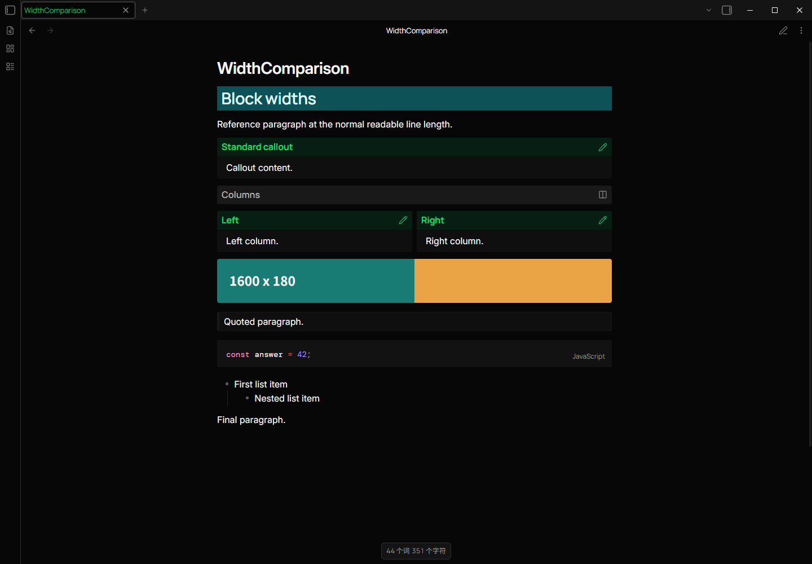
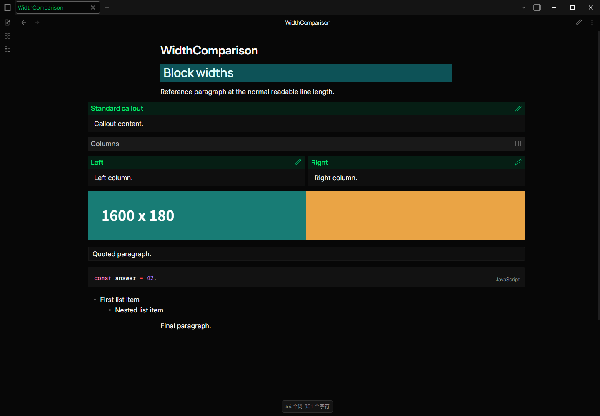
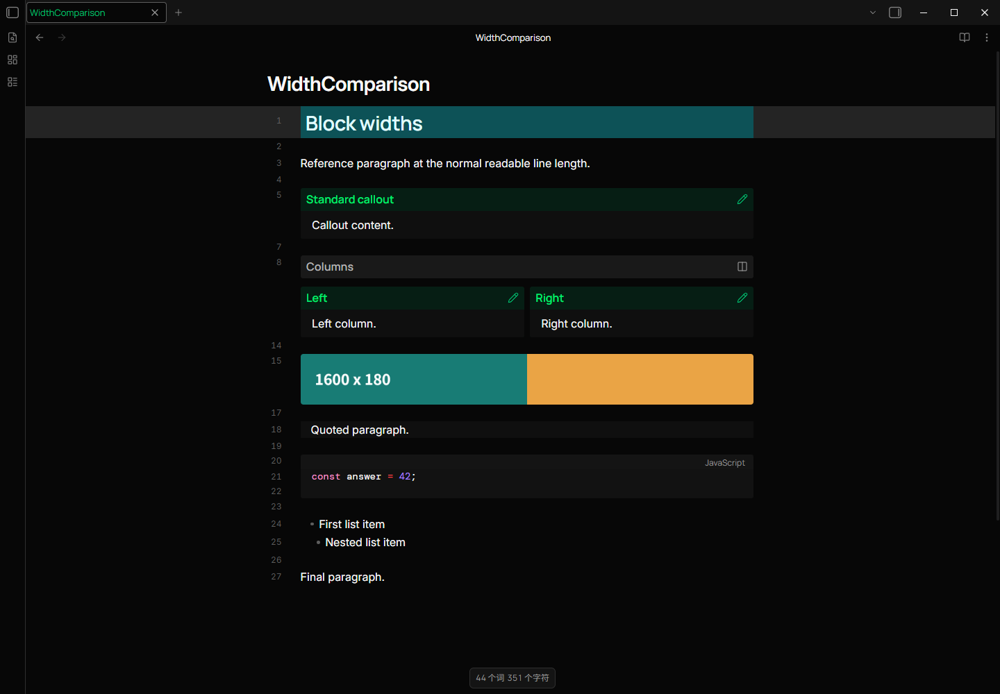
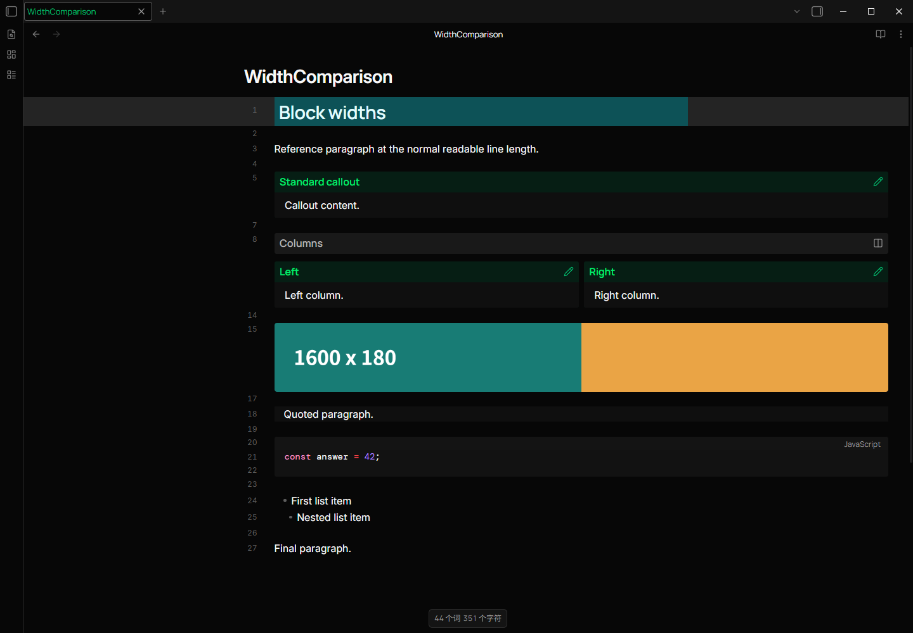
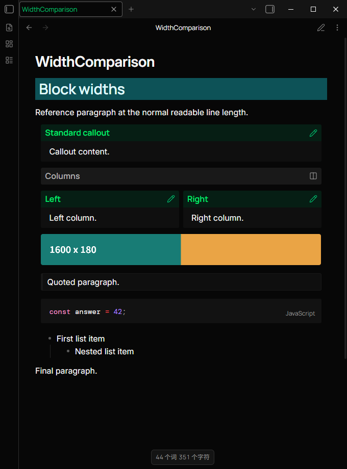
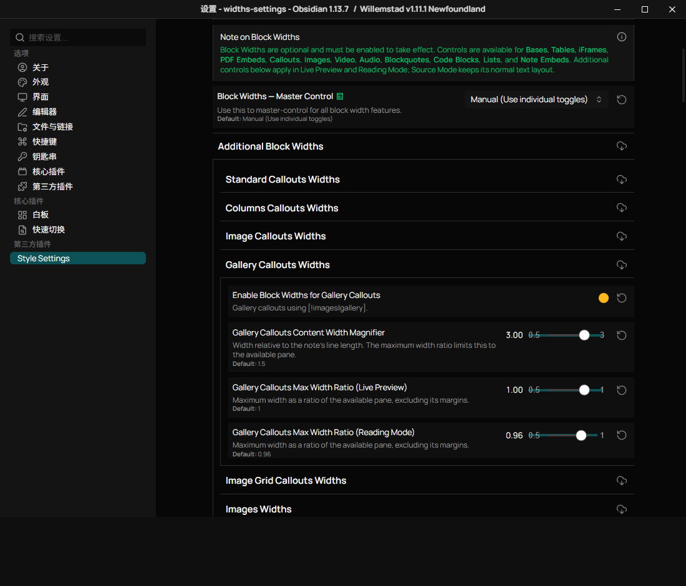

# Additional Block Widths

The remaining controls from [#57](https://github.com/tingmelvin/willemstad-x/issues/57)
are in **Style Settings > Editor > Additional Block Widths**. Each category has
an independent enable toggle, a content width magnifier, and separate maximum
width ratios for Live Preview and Reading Mode.

| Category | Content |
| --- | --- |
| Standard Callouts | Normal and custom callout types |
| Columns Callouts | `[!columns]` |
| Image Callouts | `[!images]` without gallery or grid metadata |
| Gallery Callouts | `[!images\|gallery]` |
| Image Grid Callouts | `[!images\|grid]` |
| Images | Image file embeds |
| Videos | Video file embeds |
| Audio | Audio file embeds |
| Blockquotes | Markdown blockquotes |
| Code Blocks | Fenced code text |
| Lists | Ordered, unordered, and task lists |
| Note Embeds | Notes, headings, and block embeds |

The existing **Block Widths - Master Control** applies to these categories:

- **Manual:** each category uses its own toggle. All new toggles default to off.
- **Force All On:** all eligible categories use their configured widths.
- **Force All Off:** the normal layout is restored, regardless of individual toggles.

The default magnifier is **1.5**, relative to the note's readable line length.
The default maximum ratios are **1** in Live Preview and **0.96** in Reading
Mode. The pane remains the upper bound, including in narrow windows or when
Readable Line Length is disabled. A magnifier below 1 can make a block narrower.

Reading Mode centers widened blocks. Live Preview also centers them when line
numbers are off. With line numbers on, blocks stay aligned to the text column
and grow into the space on the right, keeping the line-number gutter clear.
Source Mode retains its normal text layout.

Only top-level blocks are widened. Nested callouts, lists, quoted code, and the
contents of embedded notes keep their containing block's layout. Aside,
infobox, note-toolbar, inline, and explicitly floating callouts are excluded.
Explicit image and video widths take precedence. Existing table, Bases,
iframe, and PDF controls continue to use their existing behavior.

## Reproduce the Missing Controls

1. Use a separate vault with Obsidian 1.13 or later, Willemstad, and Style
   Settings. Disable other snippets and themes.
2. Enable **Settings > Editor > Readable Line Length**. Use a wide desktop
   window and close the sidebars so a 700px note has room to expand.
3. Create `Embedded.md` with a paragraph, a list, a quote, and a fenced code
   block. Add an image wider than 1000px as `Width.png`, a video as `Width.webm`,
   and an audio file as `Width.wav`.
4. Create a note with the fixture below. Select **Force All On** in the
   Editor's block width master control.
5. On the previous theme, the listed blocks keep their normal widths and there
   are no individual controls for them. With this change, eligible blocks
   expand while the reference paragraph stays at its original width.
6. Repeat in Live Preview and Reading Mode. Compare line numbers on and off.

````markdown
# Block widths

Reference paragraph at the normal readable line length.

> [!note] Standard callout
> Callout content.

> [!columns]
> > [!note] Left
> > Left column.
>
> > [!note] Right
> > Right column.

> [!images]
> ![[Width.png]]

> [!images|gallery]
> ![[Width.png]]

> [!images|grid]
> ![[Width.png]]

> Quoted paragraph.
>
> > Nested quote.

```js
const answer = 42;
```

- First list item
  - Nested list item
- [ ] Task item

1. Ordered item
2. Second ordered item

![[Width.png]]

![[Width.png|180]]

![[Width.webm]]

![[Width.wav]]

![[Embedded]]

> [!aside]
> This remains an aside.

Final paragraph.
````

## Verification

Verified with 119 application scenarios on Windows using **Obsidian 1.13.7**
and **Style Settings 1.0.9**. The manifest's minimum supported app version is
1.13.0. Checks covered:

- Default-off behavior, each independent toggle, both master overrides,
  custom magnifiers, and view-specific ratio limits.
- All 48 settings in the real Style Settings UI, including synchronization
  from its separate settings window to the main editor.
- Reading Mode, Live Preview with and without line numbers, unchanged Source
  Mode, a 680px-wide window, and disabled Readable Line Length.
- Aside, infobox, note-toolbar, inline, floating callouts, explicitly sized
  images and videos, nested columns, ordered and task lists, and note, heading,
  and block embeds.
- Typing and Home navigation in widened quote, code, and list lines. Active
  Line Highlight was disabled for this keyboard check to isolate block widths
  from the separately reported navigation issue #71.

These checks do not establish native macOS, Linux, iOS, or Android support, or
compatibility with community plugins that replace block rendering.

### Reading Mode

Before:



After:



### Live Preview With Line Numbers

Before:



After:



### Narrow Window and Settings




