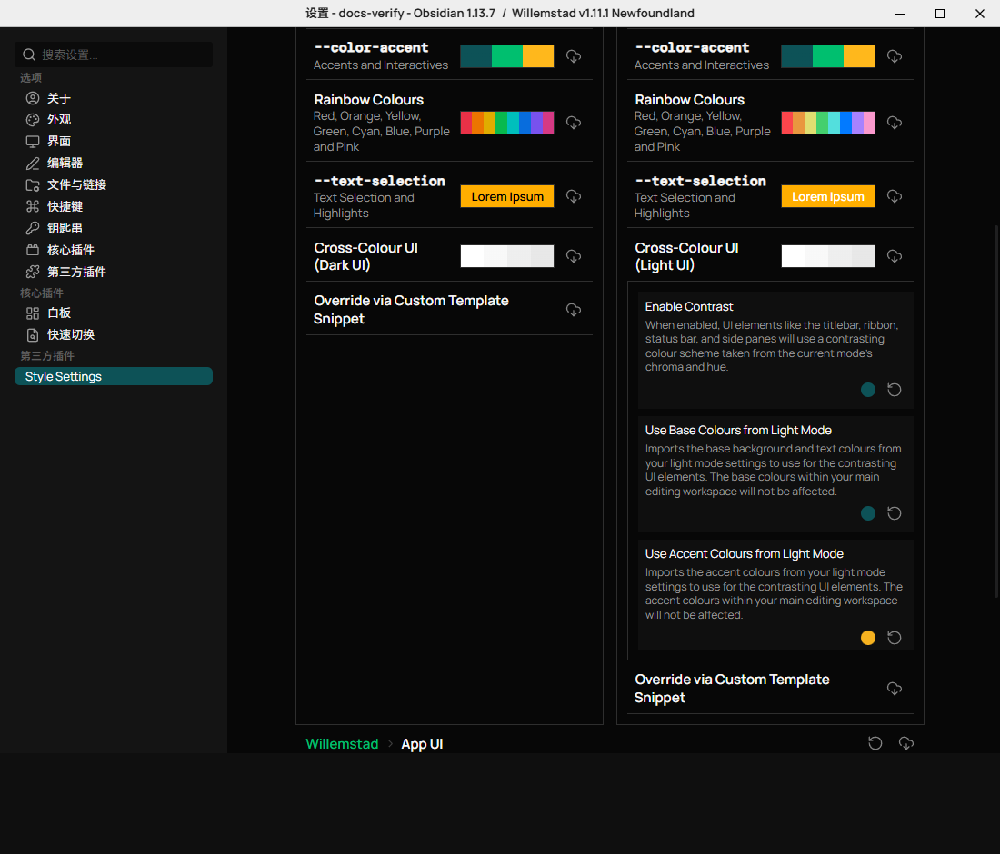
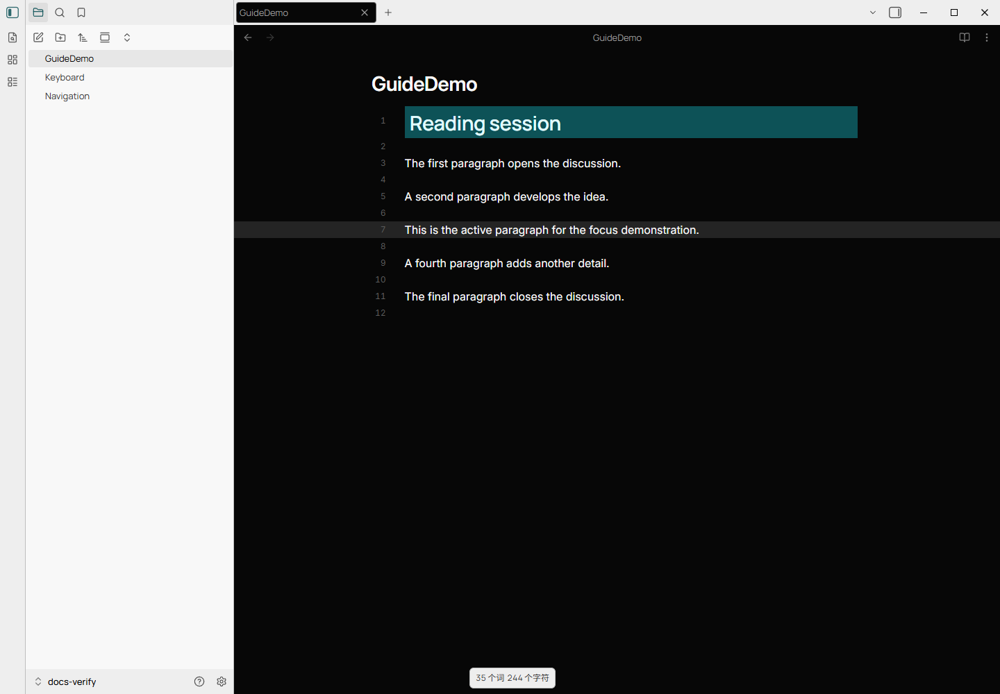

# Cross-Colour UI

Cross-Colour UI gives the titlebar, ribbon, status bar, and side panes a contrasting
colour scheme while preserving the main editor's colours. Light and dark modes
have separate settings.

## Enable Contrast

1. Install and enable **Style Settings** in **Settings > Community plugins**.
2. Open **Settings > Style Settings > Global Colours**.
3. In the active mode's settings, expand **Cross-Colour UI (Dark UI)** for a light
   editor, or **Cross-Colour UI (Light UI)** for a dark editor.
4. Turn on **Enable Contrast**.

By default, contrast uses the current mode's chroma and hue at contrasting
lightness values. The editor remains in the appearance mode selected in Obsidian.

## Import the Opposite Palette

With contrast enabled, **Use Base Colours from Dark Mode** (or **Light Mode**)
imports that mode's background and text palette into the surrounding UI. Configure
that palette under the corresponding light/dark colour settings.

**Use Accent Colours from Dark Mode** (or **Light Mode**) becomes available after
the base-colour option is enabled. It also imports the opposite mode's interactive
accent colours. These options affect the contrasting UI, not the editor.

| Active editor | Enable Contrast | Import base palette | Import accent palette |
| --- | --- | --- | --- |
| Light | `ssopt-theme-contrast-light` | `ssopt-tc-cross-l` | `ssopt-tc-accent-cross-l` |
| Dark | `ssopt-theme-contrast-dark` | `ssopt-tc-cross-d` | `ssopt-tc-accent-cross-d` |

These class names identify the settings in snippets and exported settings data.

Dark editing workspace with the light base and accent palettes applied to the UI:

## Status Bar and Recovery

Status bar controls are in **Style Settings > App UI > Status Bar**. The mini bar
can use **Frosted Glass Aesthetic**; blur is unavailable when **No Blur Backdrop
Filter** is enabled. On versions affected by
[issue #66](https://github.com/tingmelvin/willemstad-x/issues/66), the transparent
bar's colours can be difficult to read over the editor. A solid mini bar is a
temporary workaround on those versions.

Turn off **Enable Contrast** in the active mode to restore a uniform editor and UI.
For palettes that stop applying after a restart, see
[Style Settings recovery](style-settings-recovery.md).
