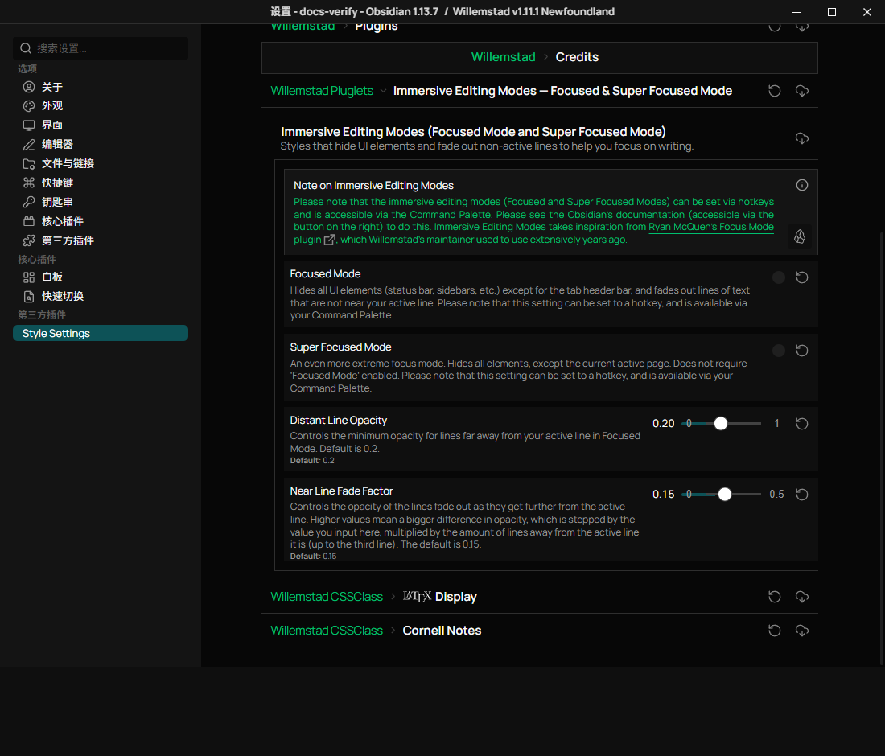
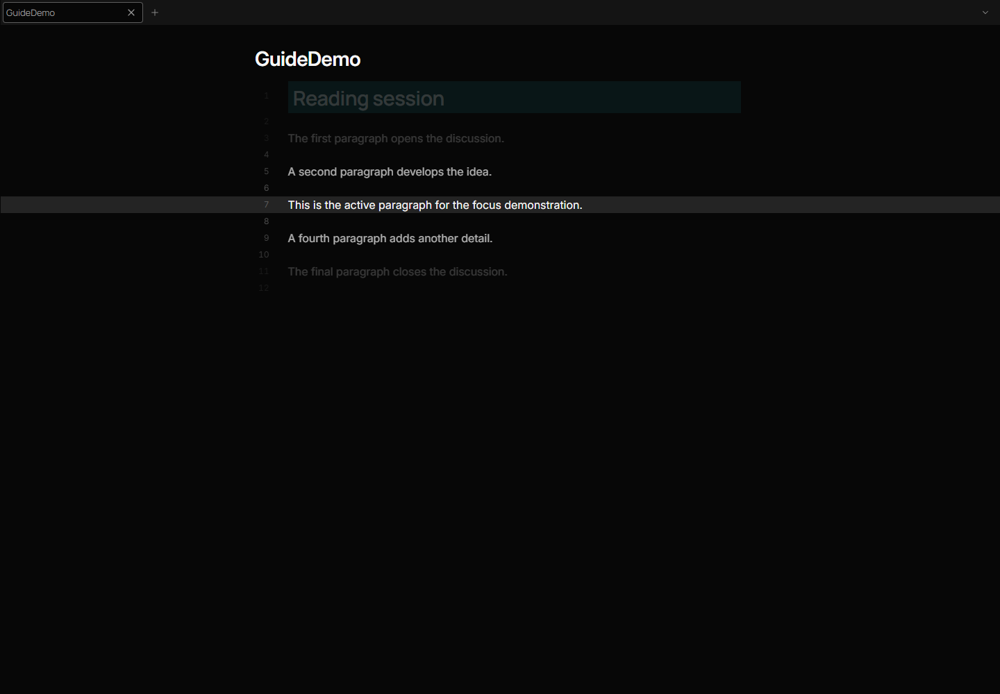
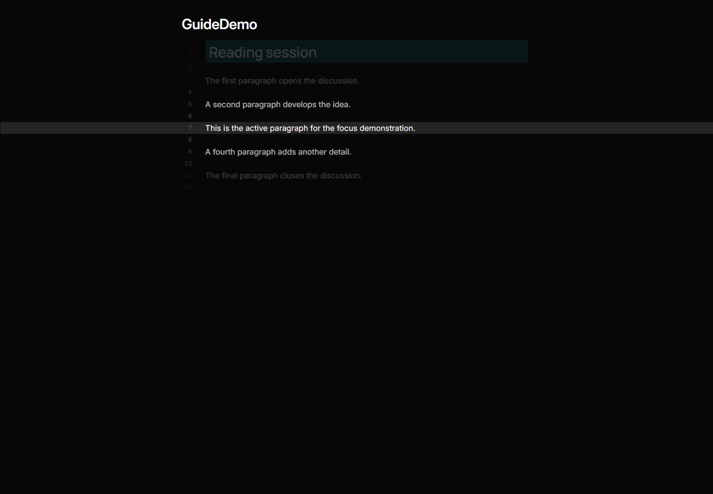

# Focused and Super Focused Mode

Open **Settings > Style Settings > Immersive Editing Modes - Focused & Super
Focused Mode**. Both modes are off by default.

| Mode | Visible interface | Setting |
| --- | --- | --- |
| Focused Mode | Editing panes and tab header bar; sidebars, ribbon, and status bar are hidden | `ssopt-focused-mode` |
| Super Focused Mode | Active page; tab headers are also hidden | `ssopt-super-focused-mode` |

Super Focused Mode works independently. If both are enabled, turn both off to
restore the normal interface.

Focused Mode keeps other editing panes visible, with their lines dimmed. Super
Focused Mode additionally hides inactive tab groups.

## Enter and Leave a Mode

1. Open a note in Source mode or Live Preview.
2. Enable **Focused Mode** or **Super Focused Mode** in Style Settings.
3. Return to the note and move the cursor. Lines away from the active line fade.
4. Use the same toggle again to restore the interface.

Both toggles register Style Settings commands in Obsidian's Command Palette.
Search for **Focused Mode** or **Super Focused Mode**, checking which command you
select. Assign a shortcut in **Settings > Hotkeys** before hiding the interface if
you prefer keyboard switching. The theme does not assign a default shortcut.

## Adjust the Fade

**Distant Line Opacity** sets the minimum opacity of far-away lines; the default
is **0.2**. **Near Line Fade Factor** controls the opacity steps near the active
line; the default is **0.15**. These affect the editing view's active-line effect.
Reading mode has no editing cursor to drive the fade.

## Examples

Focused Mode retains the tab header bar:

Super Focused Mode also hides the tab header bar:

Focused modes change presentation. They do not edit notes or disable core plugins.
For settings that disappear after a restart, see
[Style Settings recovery](style-settings-recovery.md).
