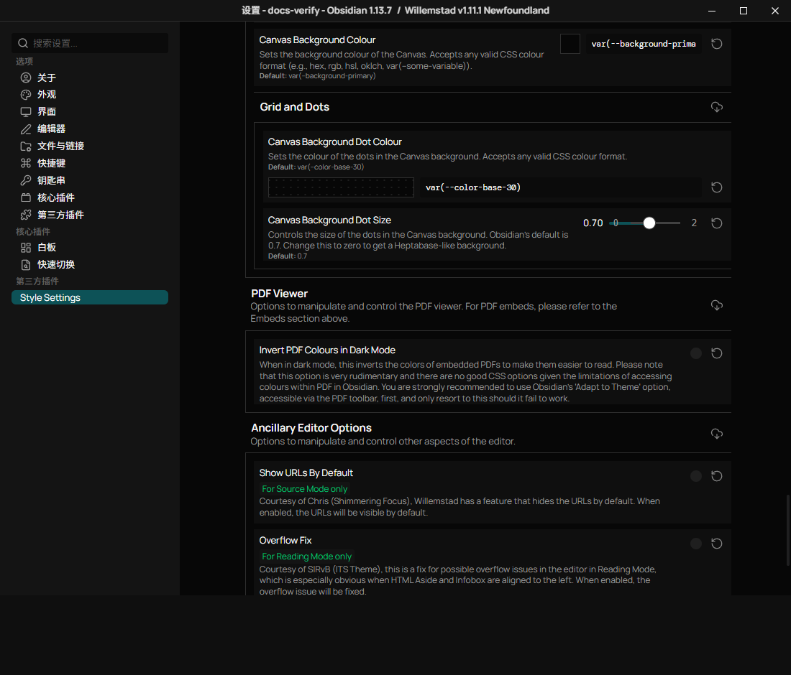
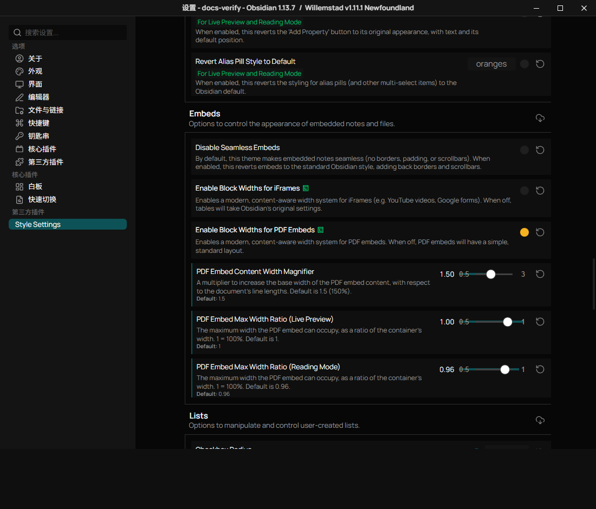

# PDF Viewing and Embeds

Willemstad styles Obsidian's existing PDF viewer. It does not replace the viewer or
provide a separate ebook reader.

## Open or Embed a PDF

Open a PDF from the file explorer for the full viewer. To embed an existing vault
file in a note, use Obsidian's normal embed syntax:

```md
![[Example.pdf]]
```

The embed renders in Live Preview and Reading mode. Source mode displays the
Markdown syntax. Navigation, zoom, search, and theme adaptation remain Obsidian
controls.

## Dark-Mode Colours

Try the PDF toolbar's **Adapt to Theme** option first. If its result is unsuitable,
open **Settings > Style Settings > Editor > PDF Viewer** and enable **Invert PDF
Colours in Dark Mode** (`ssopt-invert-pdf-dark`).

This optional CSS filter inverts the rendered PDF and adjusts hue and brightness.
It also affects images and diagrams. It applies only in dark mode and is off by
default. Compare against the original PDF before relying on colour-coded content.
Disable the toggle to restore the unfiltered view.



## Embedded PDF Width

Open **Style Settings > Editor > Embeds** and enable **Enable Block Widths for PDF
Embeds**. This controls the embed in a note, not the full PDF viewer.

| Control | Default | Effect |
| --- | --- | --- |
| PDF Embed Content Width Magnifier | 1.5 | Requested width relative to the document line width |
| PDF Embed Max Width Ratio (Live Preview) | 1 | Maximum share of the editing container |
| PDF Embed Max Width Ratio (Reading Mode) | 0.96 | Maximum share of the reading container |

The maximum ratio limits the magnified width in narrow panes. A magnifier of 1.5
does not guarantee an embed wider than the available container. The global
block-width mode also applies: forcing all widths off overrides the PDF toggle;
forcing them all on enables it regardless of that toggle. The default global mode
follows each individual setting.



## Planned Features

The ebook-specific controls mentioned in
[issue #67](https://github.com/tingmelvin/willemstad-x/issues/67) are conditional on
their release. They are not exposed in the current theme's Style Settings. This
guide covers the PDF controls implemented by the current theme.
